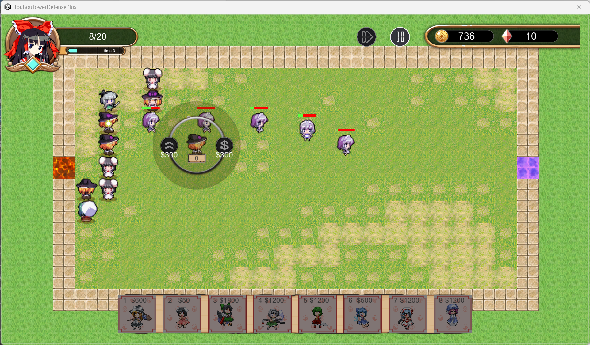

# Touhou-Tower-Defense
使用Unity开发的塔防游戏，其中使用了东方Project系列的二创美术资源。  

## 游戏内容
* 在本游戏中，敌人将自出生点（红色瓦片）生成，并向玩家大本营（蓝色瓦片）移动，玩家将用金钱购买并放置防御塔消灭敌人。游戏分为若干波次，敌人强度随波次而提升。敌人进入大本营时会对玩家生命造成伤害，若生命值归零则游戏失败；若所有波次结束时生命值仍未归零则游戏胜利。此外本游戏还设置了无尽模式（数值未平衡）。
  
* 本游戏受[fieldrunner](https://en.wikipedia.org/wiki/Fieldrunners)等游戏启发，玩家布置的防御塔可以阻碍敌人行动，因此玩家需要通过引导敌人行进路线高效利用火力。同时本游戏提供了多张地图供选择，地图中存在部分障碍物。
  
  
* 游戏中设计了支援角色系统，为玩家提供不同的局内增益效果。
  
* 本游戏设计了图鉴系统，可以查看防御塔与敌人的具体信息。目前版本设计了超过20种具有不同能外观和能力的防御塔与敌人，均为可爱的东方像素小人形象。
  

